Last updated: 2/27/2018

Value Props
===========

The **key message viewers** should take away from this demo:

-   **Easily create a bot and leverage AI **

Demo Machines (requirements) and Tools
======================================

-   Surface

-   Install VS Code

-   Install Botframework Emulator

-   Install Node.js

Demo Flow
=========

-   Open <http://dev.botframework.com>

-   Create a Bot or Skill

    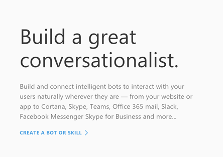{width="2.9604166666666667in"
    height="2.0868055555555554in"}

-   Hit Create

-   Create a new SDK bot hosted in Microsoft Azure

    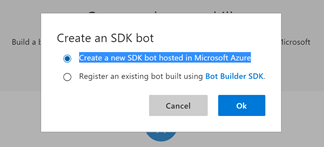{width="2.5208333333333335in"
    height="1.0568022747156605in"}

-   Enter app name

-   Choose Subscription

-   Create new Resource Group

-   Choose Hosting plan

-   Click Create

    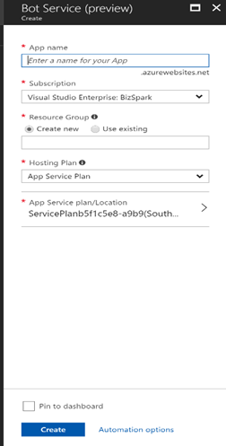{width="1.7291666666666667in"
    height="3.313888888888889in"}

-   Choose NodeJS & Language Understanding Option

    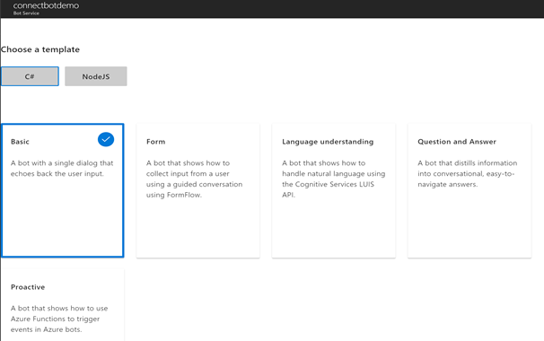{width="4.040277777777778in"
    height="2.533333333333333in"}

-   We now have a choice between C\# and NodeJS and several different
    bot templates. Today look at a Node bot that makes use of
    Microsoft's Language Understanding Intelligent Service.

-   Click Next

-   Download Zip File

-   Extract Zip File

-   Open Folder in Visual Studio Code and open app.js

-   Here's the code

    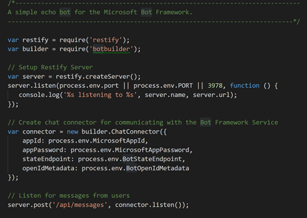{width="2.8115682414698164in"
    height="1.9895833333333333in"}{width="2.6819444444444445in"
    height="1.2760422134733158in"}

-   Let's look at this app.js file in Visual Studio Code. Here we have a
    very basic bot that will let you plug in your LUIS api keys.
    Straight out of the box, we have all of the plumbing for the bot to
    work in the emulator and be deployed. Though, It will only respond
    with "sorry, I don't understand that", though. So it's not the most
    intelligent bot on the market, yet.

-   So, let's head over to LUIS and see what we can add in to make the
    bot a little smarter. When we initiate the bot in Azure and selected
    a language understanding model, it automatically spun up an app in
    the Microsoft Cognitive Service LUIS site.

-   Open Luis.AI and open the Luis app we created

-   Go to the list of prebuilt domains- The LUIS site has a list of
    prebuilt intents/entities that we can add in automatically! How cool
    is that? Let's try one of those.

-   Add weather intents- The weather domain has two intents: Get
    Forecast and Get Condition -- you can think of get forecast as
    telling you the predictions for the weather whereas get condition
    will tell you the trends in weather like how much does it rain in
    Seattle?

-   Let's Train and publish

    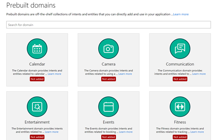{width="4.411458880139983in"
    height="2.629861111111111in"}

    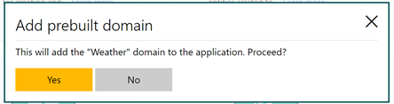{width="2.9604166666666667in"
    height="0.7798611111111111in"}

-   If we go back to the bot and change the code slightly to look for
    these new intents that we added in we can try it out.

-   If I try basic things like "what's the weather this weekend?" we get
    back that the intent is weather forecast. Awesome! That's what we
    expected. If I say "current weather" we get Weather Condition.

    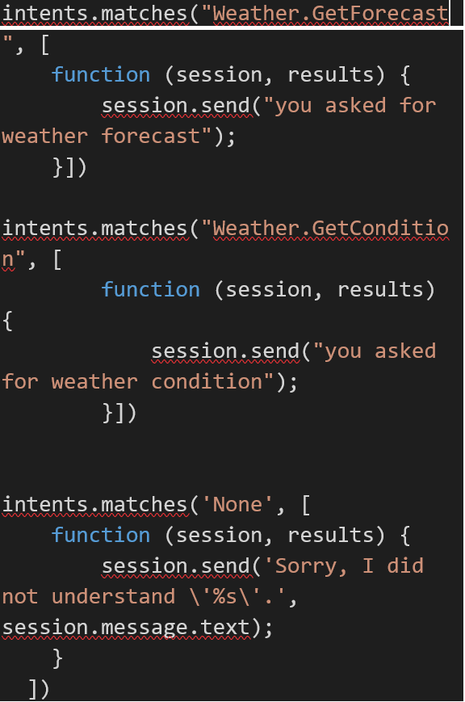{width="2.15625in"
    height="2.920614610673666in"}

-   But now if I try something like "What's your name?" it thinks that
    the intent is Get forecast. Now that doesn't seem right...

    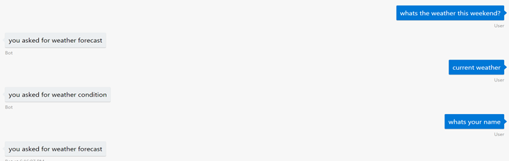{width="4.89375in"
    height="1.5534722222222221in"}

-   With a few simple utterances in LUIS we can make the bot just a
    little smarter.

-   Let's head back to LUIS and a few more in.

-   In GetCondition we want to put phrases that tell us the current
    condition or general condition trends of an area. So we will put an
    utterance like does it rain a lot in seattle and Is it currently
    raining? And in Get Forecast let's put utterances that will tell us
    future information about the weather-- tell me the weather for
    tomorrow and what will it be like tomorrow.

-   In None we can add "what time is it"

-   Let's go back and refresh our app to see what happens.

    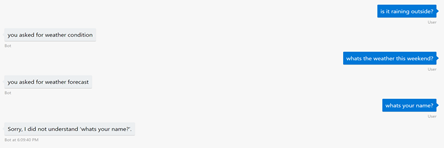{width="4.90625in"
    height="1.625in"}

-   So we can see how easy and fast it is to add AI to our bots, but
    let's see a real-life scenario of how Cognitive Service is helping
    the medical industry.

-   We recently teamed up with the Institute of Precision Medicine at
    Weill Cornell Medical to help create a Bot Precision Medicine
    Knowledgebase.

-   The extensive knowledgebase is organized to provide information
    about clinical cancer variants and interpretations in a structured
    way,

-   However, there are over 600 genes, 2000 variants with 1500 clinical
    interpretations in the database -- so going through all of the data
    can be tedious for the pathologists, doctors, and researchers, and
    as you can imagine, many of these scenarios are very time
    constrained.

-   But with the help of LUIS -- we were able to train a model that
    clinicians can now use to access data at a faster rate and as a
    result, save more lives.

-   If we take a look at the LUIS Model, the team was able to train the
    model with over 500 sample utterances pulled from different
    combinations of the genes and variants. While a regex might seem
    like the obvious solution here, there is often no pattern to what
    the genes and tumours will be called so training a natural language
    model was necessary.

-   Let's walk through some examples in Skype.

The app is now published on different channels including Skype, Teams,
Slack, Cortana with the goal of embedding it into Windows 10 IoT
Solutions as well as Mixed Reality. The possibilities are endless, and
the institute is making amazing strides to saving lives through
artificial intelligence!

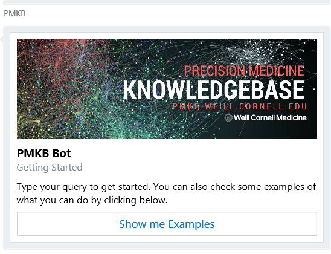{width="1.90625in"
height="1.718176946631671in"}

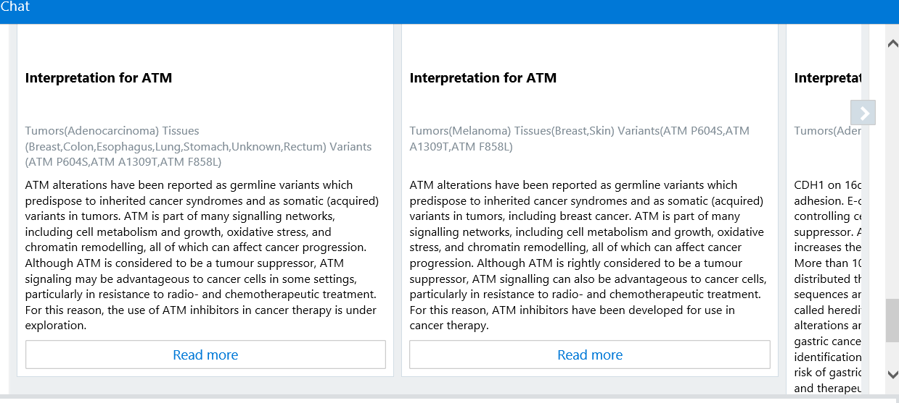{width="6.557292213473316in"
height="2.922222222222222in"}

We're excited to show how easy it is to create a bot service in Azure
and leverage our AI technologies to it.

As you can see I am on the dev.botframework website where I can create a
new bot or skill. I have the option to create a new SDK bot hosted in
Microsoft Azure or to Register an existing bot. Today we will create a
new SDK bot hosted in Microsoft Azure. This will automatically bring us
to create a new bot service in Azure. We quickly enter an app name and
credentials.

-   And voila! We now have a bot that's ready to be configured.

<!-- -->

-   Open dev.botframework.com

-   Create a Bot or Skill

-   Create

-   Create a new SDK bot hosted in Microsoft Azure

-   Enter app name

-   Choose Subscription

-   Create new Resource Group

-   Choose Hosting plan

-   Click Create

-   Choose NodeJS & Language Understanding Option

-   Click Next

-   Download Zip File

-   
