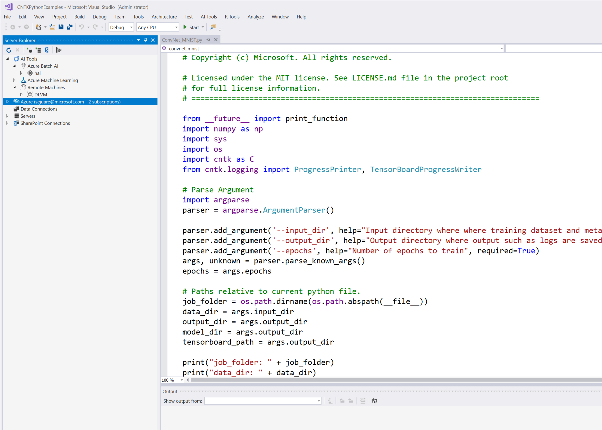
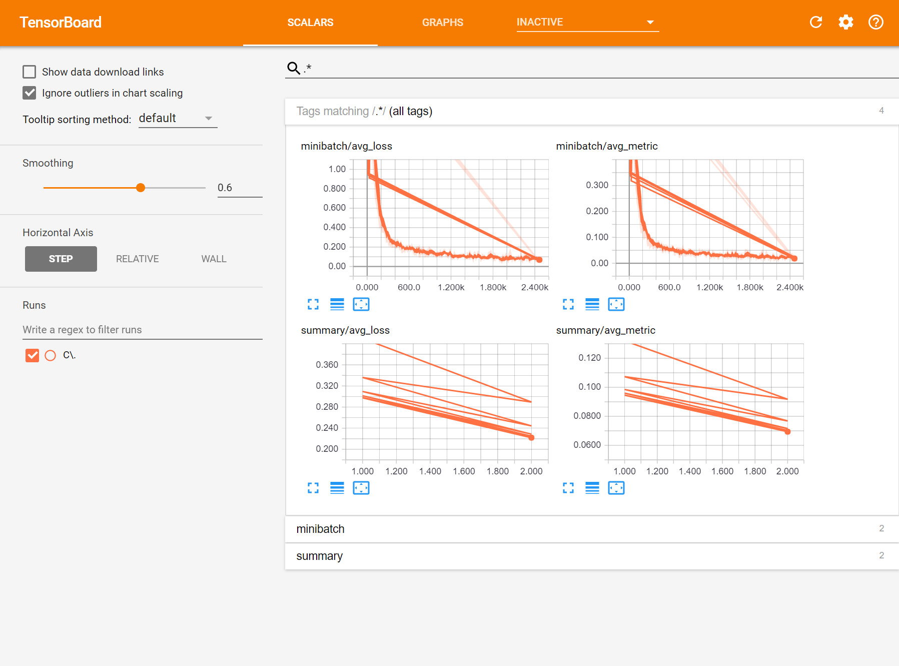
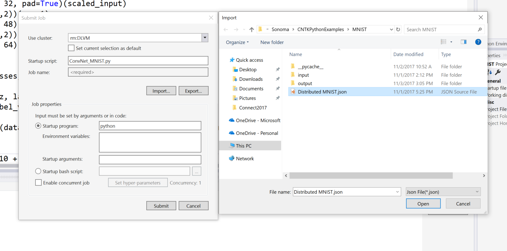
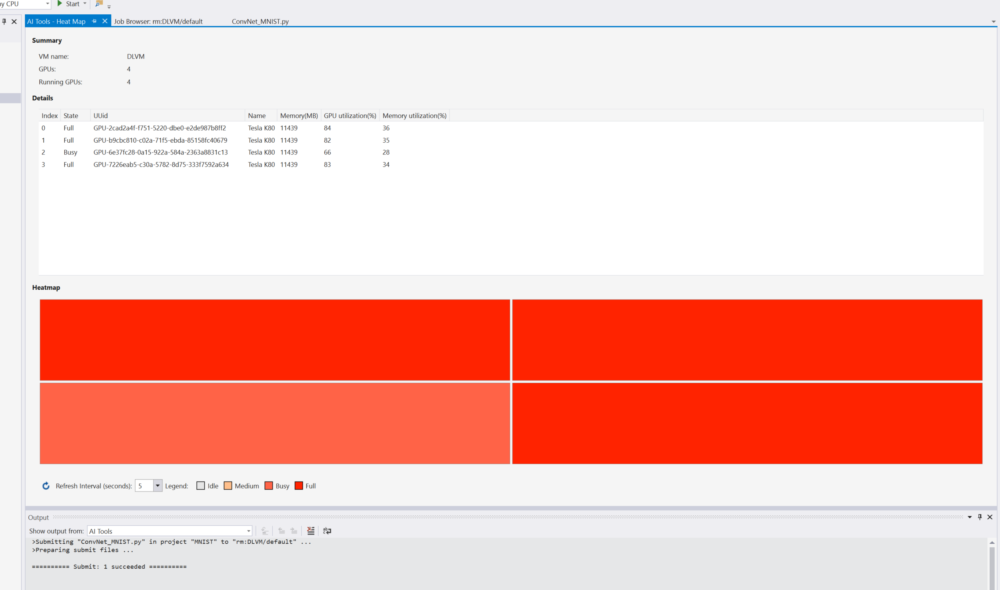
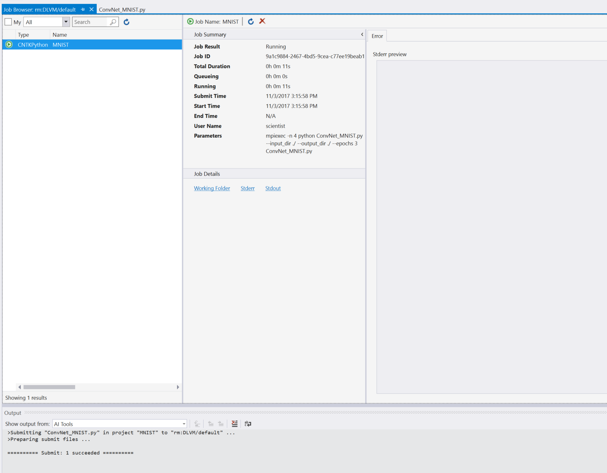
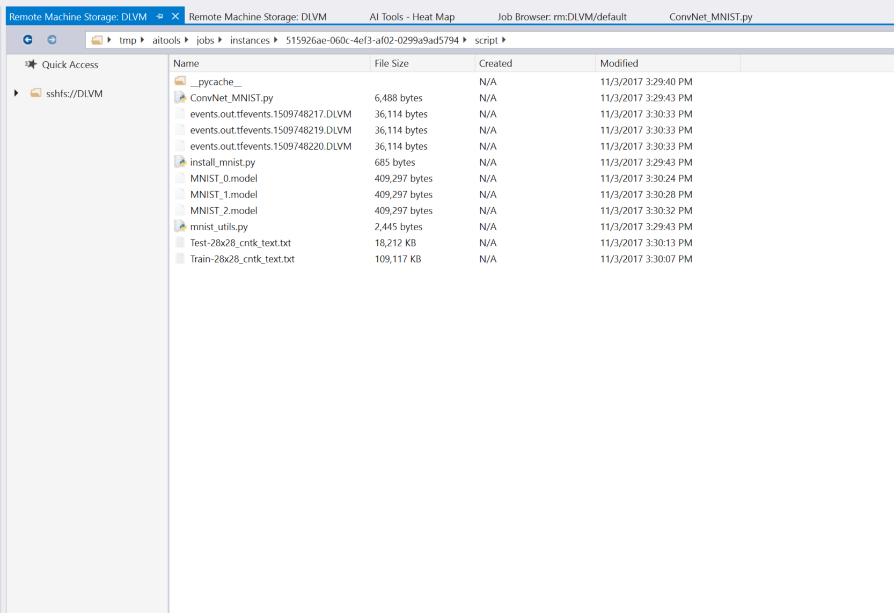
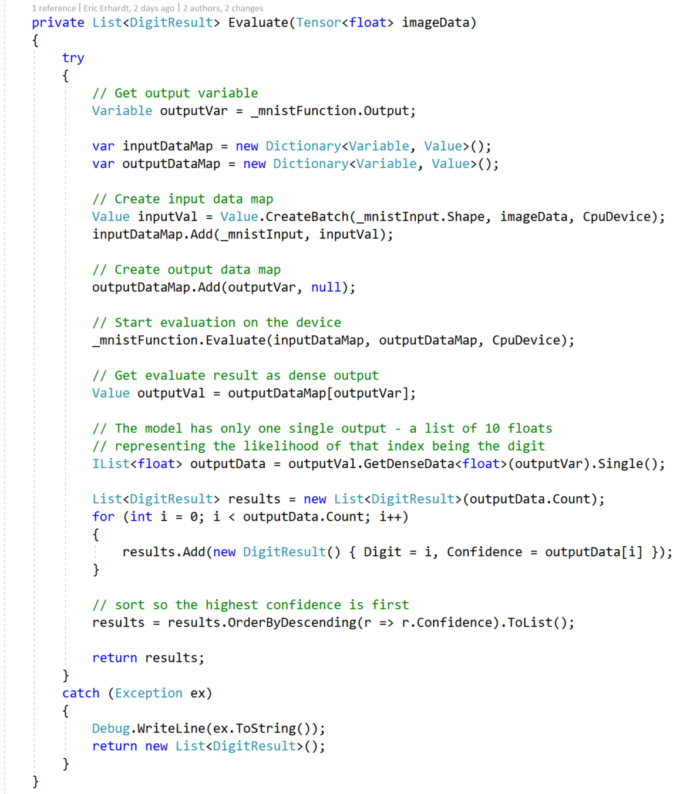
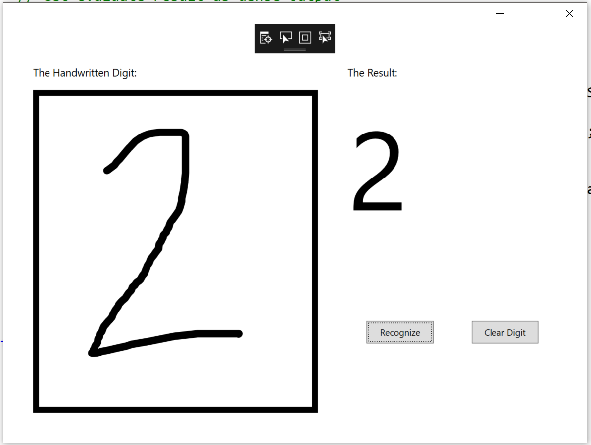

Microsoft

Visual Studio Tools for AI

Last updated: 2/12/2018

Value Props
===========

**Key Message** -- VISUAL STUDIO TOOLS FOR AI IS A POWERFUL TOOL FOR
TRAINING AI MODELS THAT ARE EASY TO INTEGRATE INTO YOUR APPLICATIONS

1.  Can train and debug on your local machine to test quickly

2.  Can train models on powerful VMs in Azure or on-prem Linux machines

3.  Can train models using Azure Batch AI to dynamically spin up/down
    VMs so you only pay for them when you need them

4.  Can train models using Azure ML to get visibility into how your
    experiment improves over time

5.  Can export models to use in applications

# Sample deep learning application using Visual Studio Tools for AI
In this sample you'll learn to use Visual Studio Tools for AI to train a deep learning model locally and scale-out to Azure, then include that model in an application. 

## Learn how to use Visual Studio Tools for AI
Visit our [Github site](https://github.com/Microsoft/vs-tools-for-ai) to learn more
 
## Prerequisites
- Install [Visual Studio](https://www.visualstudio.com/downloads/) Community edition or above
- [Prepare your local machine](https://github.com/Microsoft/vs-tools-for-ai/blob/master/docs/prepare-localmachine.md) with Python, TensorFlow and more by following the steps at the wiki to ensure you have Python, TensorFlow, CNTK, etc or use our [simple installer](https://github.com/Microsoft/samples-for-ai/tree/master/installer)
- Install [Visual Studio Tools for AI](https://marketplace.visualstudio.com/items?itemName=ms-toolsai.vstoolsai-vs2017)

## Steps
- Open MNIST.sln using Visual Studio
- Open Train_MNIST.py 
- Follow steps to [train on your local machine](https://github.com/Microsoft/vs-tools-for-ai/blob/master/docs/tensorflow-local.md) or [train in Azure](https://github.com/Microsoft/vs-tools-for-ai/blob/master/docs/tensorflow-vm.md) 
- Download model and replace digit.model in the Digitz app
- Select the digit.model and set the "Copy to output directory" property to "Copy if newer"
- Set Digitz.app as startup project and run it

Demo Machines (requirements) and Tools
======================================

-   Surface Book 2 with GPU

-   Install OpenMind pre-reqs for python

-   Visual Studio Latest

-   Install Visual Studio Tools for AI

Demo Pre-Setup and Cleanup
==========================

-   Hook up DLVM

-   Hook Up Batch AI

-   Open up Simple MNIST Project

-   Run python code at least once to pre-download the files

-   Expand all of the appropriate nodes beforehand in order to reduce
    latency

-   Make sure AML folders are cleared

Demo Flow 
==========

**[Visual Studio Tools for AI]{.underline}**

-   **File -\> New -\> Template**

> 

**Explanation**-

-   Everybody knows AI is super-hot right now, but a whole lot of devs
    still find the whole process of training and deploying AI models in
    their app a bit of a dark art.

-   Announcing Visual Studio Tools for AI which makes it easy to train
    models on your local machine or scale out to use the power of Azure
    super easy, and including the model in your app is even easier .

-   **Start with Python MNIST Project. -\> Walk through code-\> Set
    breakpoint to debug locally-\> Check value of local variables-\>
    Continue-\> Show data while tool is running**

> 

**Explanation**- **\[-- Running Python Code\]**

-   This is so exciting. Writing and debugging python in VS is super
    easy ... set breakpoint, Run

-   Let run for few epochs ... looks like its improving accuracy pretty
    quickly! Let's check TensorBoard

-   While this is running locally let me show you the data

    -   Right click MNIST py proj in upper right, select Run TensorBoard

    -   Select output folder, click OK

        

> **Explanation**- \[-**Showing TensorBoard\]**

-   This helps show that we embrace OSS, everything I just showed you
    works with TensorFlow, Caffe, Keras and more

-   But running on your local machine only gets you so far. More data
    always beats better algorithms

-   Using the power of Azure I can get a VM with 4 GPUs and a boatload
    of memory

-   VS Tools for AI makes it super easy to submit to the VM

<!-- -->

-   Right click, submit to VM

-   Click Import, select json

-   Submit

    

> **Explanation- \[-Submitting Job to the VM\]**

-   Passing args on the cmdline to python is super common, and if you
    want you can save your settings for each of these text boxes etc

-   See we even can remember to run the job using MPIExec which runs my
    python script across all 4 GPUs on the VM

-   But lets take a look at this heatmap I can see the GPUs now are
    warming up, change to 5 sec refresh, now they are running hot and
    BOOM! Done.

-   **Right Click -\> Show heatmap\
    **(SET TO 5s REFRESH)

    

<!-- -->

-   Browse Jobs

-   Hit stdout to download

-   Open Working Folder

    

    Explanation-

    -   Now I can see the history of all the jobs I ran recently

    -   I can see my new job is running

    -   I can even get the stdout

    -   See the data is being downloaded

    -   Notice Working folder

    -   I can see it even saved the version of the script on the VM so I
        can now which results I got with which version of the script

    -   But lets take a look at this heatmap I can see the GPUs now are
        warming up, change to 5 sec refresh, now they are running hot
        and BOOM! Done.

<!-- -->

-   Open working folder

-   Save model to desktop

-   (AI Infrastructure) BatchAI / VMs

> 

Explanation-

-   I can submit to Azure Batch AI, a new service in Azure, that will
    even spin up and spin down the VM for me to keep it running just
    during my job

-   Available in different form factors - Interactive VMs and Azure
    Batch Nodes. Use same VM to develop on a single VM and run it in
    batch across multiple nodes in parallel in exactly same DSVM
    environment.

-   Can run on either CPU only VM instances or instances with GPUs.

-   DSVM is extensible and you have full control. Create ARM extensions
    to replicate your environment, add-on extra proprietary software.

-   Great environment to locally build Spark applications and then scale
    out on HDInsight. In fact on the Ubuntu DSVM you can build it
    locally and just repoint your Jupyter kernel to HDInsight instance
    (with the built-in Sparkmagic kernel) and execute the same notebooks
    on the HDI cluster

-   Leverage all the innovations in Azure IaaS right away (like VNets,
    Encryption, scale sets/autoscaling, monitoring/management, faster /
    bigger VM instances, auto shutdown etc).

-   Works well with Azure Machine Learning. All tools (workbench, CLI,
    SDKs) are all built in. Ubuntu Linux DSVM can be a remote execution
    target. Preferred environment to run GPU workloads in Azure machine
    learning locally.

<!-- -->

-   **Right Click -\> Register as AzureML Project (AML Node)**

    -   I can even submit to Azure ML so I can track the quality of my
        experiments over time

    -   Starting is super easy, backed by our awesome azure machine
        learning experimentation service

    -   AML Experimentation is great for collaborating,

    -   Manages experiments

    -   Manages models

    -   But who cares, you're devs right? Lets show you how easy it is
        to take the model and build the app

-   **Open WPF Project-\> Add mnist.model to project**

    -   Just pretend the cntk model is like an assembly what would you
        do?

    -   Add the model as a reference and see what input it wants

    -   True, we've already written two functions that help with that
        "ConvertImage" to get it into the right input shape (it expects
        a list of numbers" and "Evaluate" that takes the list of numbers
        and predicts a result.

    -   What is Tensor?

    -   To make it easy for Machine Learning Libraries like CNTK,
        Tensorflow to expose their API(s) to .NET applications while
        bringing in minimal custom dependencies, we are introducing a
        new type Tensor\<T\>.

    -   Tensor\<T\> is a container for homogenous multi-dimensional data
        for 1 to N dimensions.

    -   Tensor\<T\> is designed to provide a Good exchange type for
        multi-dimensional machine-learning data, it supports different
        layouts (sparse and dense) and provides efficient interop with
        native ML libraries like CNTK while ensuring minimal copies of
        data.

    -   You can try Tensor\<T\> using the dotnet/corefxlab repo for now,
        while we have plans for it becoming a part of the base class
        libraries soon.

-   **Eval **

    

    -   Yes! We are literally moving the picture into the proper input
        shape and calling Evaluate on the data.

    -   Then we're taking the output and pushing it into a DigitResult

    -   Let's set a breakpoint on line 97 and run the project

-   **Run Project**

-   **Write a number**

-   **Explore locals -\> outputData**

    
